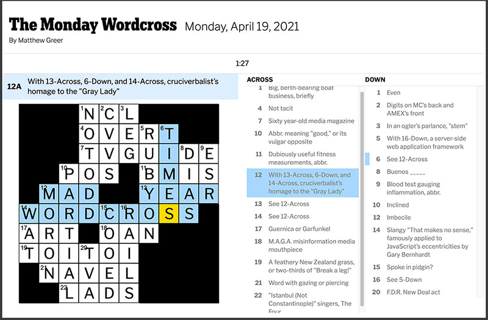
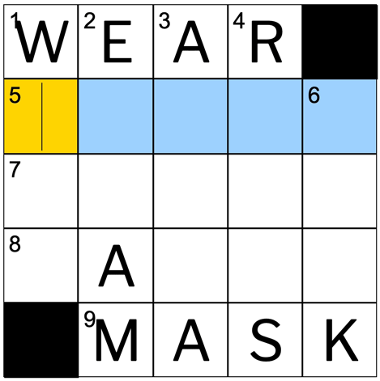
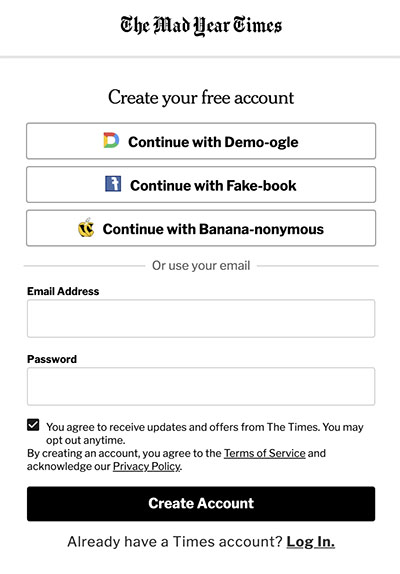
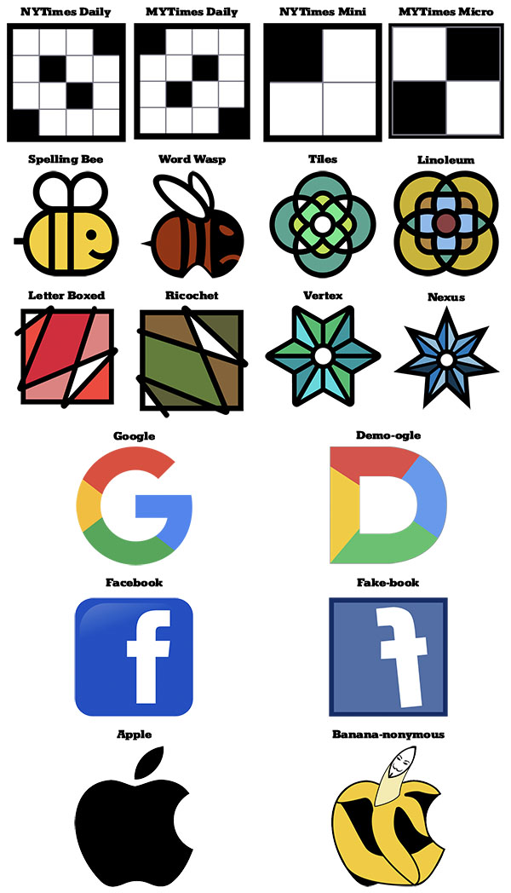
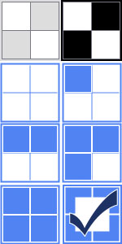
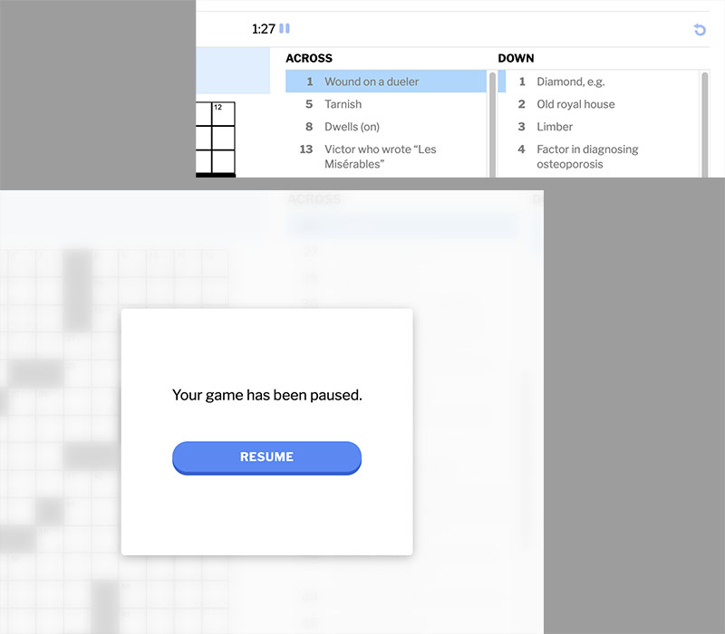

  
# an homage to [The New York Times®️ Crossword Web App](https://www.nytimes.com/crosswords)  

## by [Matthew Greer](https://www.linkedin.com/in/matthewgreerdev) | [matthew.greer.dev@gmail.com](mailto:matthew.greer.dev@gmail.com?subject=GitHub%20MYTimes%20Crossword) | [matthewgreer.net](http://www.matthewgreer.net) | [LIVE ON HEROKU](https://mytimes-crossword.herokuapp.com/#/)

  
## TABLE OF CONTENTS
--------------------
* ### [ABOUT](#About)
* ### [TECH](#Tech)
* ### [FEATURES](#Features)
* ### [FUTURE](#Future)
* ### [ACKNOWLEDGEMENTS](#Credit)
* ### [ABOUT ME](#Me)
* ### [INSTALL](#Install)

* * *
## <a name="#About"></a>ABOUT

The **MYTimes Wordcross** is my loving homage to [The New York Times®️ Crossword Web App](https://www.nytimes.com/crosswords). Designed to closely mimic its source's styling and functionality using original SCSS/CSS and JavaScript UI/UX, **MYTimes** presents a fully-featured crossword game, plus the creation and storage of user accounts.

<table style="margin: 0 auto;">
  <th><h2 style="font-style: italic; color: #EC4308;">Why <strong>"Mad Year Times"</strong>?</h2></th>
  <tr>
    <td width="500px">
      <p style="font-style: italic; color: #EC4308;">I wanted the logos, etc. to be a close relative of the original New York Times®️ logo.</p>
      <p style="font-style: italic; color: #EC4308;"><strong>I also wanted to avoid litigation.</strong></p>
      <p style="font-style: italic; color: #EC4308;">The acronym stand-in for the "NY" equates to the word "my," since this project was developed solely by myself, as my first larger-scale full-stack application.</p>
      <p style="font-style: italic; color: #EC4308;">Replacements for the full words needed to be the same length as "New" and "York", which limited the playing field.</p>
      <p  style="font-style: italic; color: #EC4308;">Ultimately, the app was developed during the "unprecedented" year 2020, so "The Mad Year Times" seemed right on the nose--a nose which was, of course, covered in public by a mask.</p>
    </td>
    <td>
      
    </td>
  </tr>
</table>

* * *
## <a name="#Tech"></a>TECH
**PostgreSQL | Ruby on Rails | jBuilder | bCrypt | jQuery**  
**Node | React | Redux | Webpack**

| Required | Gem/Package | Version
|---------------|--------------------|--------------|
| [PostgreSQL](https://www.postgresql.org/download/) | | |
| [**Ruby**](https://www.ruby-lang.org/en/downloads/) | | **2.5.1p57** |
| | `bundler` | 2.2.15 |
| | `rails` | 5.2.4.4 |
| | `pg` (postgresql) | 1.2.3 |
| | `puma` | 3.12.6 |
| | `sass-rails` | 5.1.0 |
| | `uglifier` | 4.2.0 |
| | `jbuilder` | 2.10.1 |
| | `bcrypt` | 3.1.16 |
| | `jquery-rails` | 4.4.0 |
| | `byebug` (development/test only) | 11.1.3 |
| | `better_errors` (development/test only) | 2.8.3 |
| | `binding_of_caller` (development/test only) | 0.8.0 |
| | `pry-rails` (development/test only) | 0.3.9 |
| | `annotate` (development/test only) | 2.7.5 |
| [**Node.js**](https://nodejs.org/en/download/) | | **10.13.0** |
| **NPM** | | **6.14.7** |
| | `@babel/core` | 7.10.5|
| | `@babel/preset-env` | 7.10.4 |
| | `@babel/preset-react` | 7.10.4 |
| | `babel-loader` | 8.1.0 |
| | `react` | 16.13.1 |
| | `react-dom` | 16.13.1 |
| | `react-redux` | 7.2.1 |
| | `react-router-dom` | 5.2.0 |
| | `redux` | 4.0.5 |
| | `redux-logger` | 3.0.6 |
| | `redux-thunk` | 2.3.0 |
| | `webpack` | 4.44.0 |
| | `webpack-cli` | 3.3.12 |
| | `hamburgers` [@jonsuh](#Credit) | 1.1.3 |

***
## <a name="#Features"></a>FEATURES
* ### MYTimes "subscribes" users, securely storing `bcrypt` hashed password digests, puzzle progress, and solving streaks in a `PostgreSQL` relational database. 
<table style="margin: 0 auto;">
  <tr>
    <td width="200px">
      <p style="font-style: italic;">While the <strong> New York Times®️</strong>  allows non-subscribers access to their daily <strong> Mini</strong>  puzzle and requires a valid login for the regular <strong> Daily</strong>  puzzle, <strong> MYTimes</strong>  differs in that both <strong> Daily</strong>  and <strong> Micro</strong>  puzzle types are beyond the subscriber wall. But <strong> MYTimes</strong>  doesn't charge for a subscription, so I think it's more than a fair trade-off. 😄 </p>
    </td>
    <td>
      
    </td>
  </tr>
</table>


* ### `Rails` streamlines API requests over RESTful routes, using `jBuilder` to respond succinctly with `JSON`. A token is stored client-side to persist login across sessions.  

```ruby
namespace :api, defaults: { format: :json } do
    resources :users, only: [:create, :update] do 
      get 'user_dailies/:wordcross_date', to: 'user_dailies#show', as: 'daily_fetch'
      patch 'user_dailies/:id', to: 'user_dailies#update', as: 'daily_update'
      get 'user_micros/:wordcross_date', to: 'user_micros#show', as: 'micro_fetch'
      patch 'user_micros/:id', to: 'user_micros#update', as: 'micro_update'
    end
    get 'dailies/:wordcross_date', to: 'dailies#show', as: 'daily_fetch_author'
    get 'micros/:wordcross_date', to: 'micros#show', as: 'micro_fetch_author'
    resource :session, only: [:create, :destroy]
  end
  root to: "static_pages#root" 
```

* ### The database is seeded with seven **Micro** puzzles and seven **Daily** puzzles, and a different one is served for each day of the week. `React` components and `Redux` state allow for efficient single-page rendering and DOM updating. 

```ruby
microSun = Micro.create!(
  wordcross_date: '2020-08-03',
  author: 'Joel Fagliano', 
  solution: [
```
`SOLUTION REDACTED--No Cheating!`
```ruby
  ],
  label_set: [
    ['#', '#', '1', '2', '3'],
    ['4', '5', ' ', ' ', ' '],
    ['6', ' ', ' ', ' ', ' '],
    ['7', ' ', ' ', ' ', ' '],
    ['8', ' ', ' ', '#', '#']
  ],
  clue_set: {
    a1: {
      direction: 'across',
      number: 1,
      boxes: ['0,2','0,3','0,4'],
      clue: 'Dog name like Hairy Pawter, e.g.'
    }, 
    a4: {
      direction: 'across', 
      number: 4, 
      boxes: ['1,0','1,1','1,2','1,3','1,4'],
      clue: 'Unit of stock'
    }, 
    a6: {
      direction: 'across', 
      number: 6, 
      boxes: ['2,0','2,1','2,2','2,3','2,4'],
      clue: 'Africa’s Republic of the ______'
    }, 
    a7: {
      direction: 'across', 
      number: 7, 
      boxes: ['3,0','3,1','3,2','3,3','3,4'],
      clue: 'U.F.O. Pilot'
    }, 
    a8: {
      direction: 'across', 
      number: 8, 
      boxes: ['4,0','4,1','4,2'],
      clue: 'Restaurant suggestion, for short'
    }, 
    d1: {
      direction: 'down', 
      number: 1, 
      boxes: ['0,2','1,2','2,2','3,2','4,2'],
      clue: 'Hysteria'
    }, 
    d2: {
      direction: 'down', 
      number: 2, 
      boxes: ['0,3','1,3','2,3','3,3','4,3'],
      clue: 'Strong desire'
    }, 
    d3: {
      direction: 'down', 
      number: 3, 
      boxes: ['0,4','1,4','2,4','3,4'],
      clue: 'Element below helium on the periodic table'
    }, 
    d4: {
      direction: 'down', 
      number: 4, 
      boxes: ['1,0','2,0','3,0','4,0'],
      clue: 'Disney villain who kills Mufasa'
    }, 
    d5: {
      direction: 'down', 
      number: 5, 
      boxes: ['1,1','2,1','3,1','4,1'],
      clue: 'Bagel’s center'
    }
  }
)
```

* ### Several `JavaScript`/`React JSX` methods respond to user clicks and keystrokes, closely emulating the solving behavior of the NYT puzzle app. 

```javascript
// methods for processing user input -- keys
  // =========================================
  
  handleTabOrEnter(shifted) {
    // shifted (SHIFT + TAB or SHIFT + ENTER) moves in opposite direction
    const { activeClueName, board, solvingDirection } = this.state;
    let cluesArray = this.solvingDirectionCluesArray();
    const extremeIndex = shifted ? 0 : (cluesArray.length - 1);
    let newIndex;
    let newClue;
    let nextDirection;
    let nextBoxInFocusName;
    
    // check if the activeClueName is the last (or first, if shifted) clue
    //   in that direction
    if ( cluesArray.indexOf(activeClueName) === extremeIndex ) {
      // if activeClue IS at the extremity, switch directions
      cluesArray = this.oppositeCluesArray(cluesArray);
       // get the index for the first (or last, if shifted) clue in the
      //   opposite direction
      newIndex = shifted ? cluesArray.length - 1 : 0;
      // set the newClue
      newClue = cluesArray[newIndex]
      nextDirection = this.oppositeSolvingDirection();
    } else {
      // if activeClueName is NOT at the extremity,
      const currentIndex = cluesArray.indexOf(activeClueName);
      newIndex = shifted ? currentIndex - 1 : currentIndex + 1;
      newClue = cluesArray[newIndex];
      nextDirection = solvingDirection;
    }

    // next, check if the next activeClue is completed or not
    if ( this.isClueEntryCompleted(newClue, board) === true ) {
      // if this clue is completed, focus on the first box of the clue
      nextBoxInFocusName = this.clueBoxesArray(newClue)[0];
    } else {
      // if this clue is NOT completed, focus on the first empty box in 
      //   the clue entry
      nextBoxInFocusName = this.nextEmptyBoxInClueEntry(
        this.clueBoxesArray(newClue)[0],
        newClue,
        board
      );
    }
    this.setSolvingDirection(nextDirection);
    return this.setBoxInFocusName(nextBoxInFocusName);
	};

	handleSpacebar(){
		return this.switchSolvingDirection();
	};

	handleDelete(){
    // Do nothing if the puzzle is solved, otherwise remove any value in that
    //   box's input field.
    if ( this.isWordcrossSolved === true ) { return null };    
    return this.updateBoard(this.state.boxInFocusName, '');
	};
	
	handleBackspace(){
    let priorClueName;
    let previousBox;
    let nextDirection;
    const { board, boxInFocusName, activeClueName } = this.state;
    const oppositeClues = this.oppositeCluesArray(this.state.solvingDirection);
    const activeClueIndex = this.solvingDirectionCluesArray()
      .indexOf(activeClueName);
    if ( activeClueIndex > 0 ) {
      // if activeClue is not the first clue in its direction, assign the clue
      //   at the previous index
      priorClueName = this.solvingDirectionCluesArray()[activeClueIndex - 1];
    } else {
      // if activeClue IS the first clue in its direction, assign the clue
      //   at the final index of the opposite direction
      priorClueName = oppositeClues[oppositeClues.length - 1];
    }
    const activeClueBoxesArray = this.clueBoxesArray(activeClueName);
    const priorClueBoxesArray = this.clueBoxesArray(priorClueName);
    const boxInFocusIndex = activeClueBoxesArray.indexOf(boxInFocusName);
    if ( boxInFocusIndex > 0 ) {
      // if boxInFocus is not the first box in the clue entry, assign the box
      //   at the previous index
      previousBox = activeClueBoxesArray[boxInFocusIndex - 1];
      nextDirection = this.state.solvingDirection;
    } else {
      // if boxInFocus IS the first box in the clue entry, assign the last box
      //   of the prior clue entry
      previousBox = priorClueBoxesArray[priorClueBoxesArray.length - 1];
      nextDirection = this.directionOfClue(priorClueName);
    }
    // Do nothing if the puzzle is solved.
    if ( this.isWordcrossSolved === true ) {
      return null 
    } else {
      // if boxInFocus is filled
      if ( this.isBoxFilled(boxInFocusName, board) === true ) {
        // clear the current box and keep focus where it is
        return this.updateBoard(boxInFocusName, '');
      } else {
      // if boxInFocus is empty
        // shift focus to the previous box and clear it
        this.updateBoard(previousBox, '');
        this.setSolvingDirection(nextDirection);
        return this.setBoxInFocusName(previousBox);
      }
    }
	};

	handleArrowKey(direction) {
    switch(direction) {
      case 'ArrowUp':
        if (this.state.solvingDirection === 'across') {
          this.switchSolvingDirection();
          this.setSolvingDirection('down');
        }
        return this.shiftBoxInFocusAlongGrid( [-1, 0] );
      case 'ArrowDown':
        if (this.state.solvingDirection === 'across') {
          this.switchSolvingDirection();
          this.setSolvingDirection('down');
        }
        return this.shiftBoxInFocusAlongGrid( [1, 0] );
      case 'ArrowRight':
        if (this.state.solvingDirection === 'down') {
          this.switchSolvingDirection();
          this.setSolvingDirection('across');
        }
        return this.shiftBoxInFocusAlongGrid( [0, 1] );
      case 'ArrowLeft':
        if (this.state.solvingDirection === 'down') {
          this.switchSolvingDirection();
          this.setSolvingDirection('across');
        }        
        return this.shiftBoxInFocusAlongGrid( [0, -1] );
      default:
        return null;
    }
  };
```

* ### Others track the level of puzzle completion and, like the NYT, display a series of icons on the main view to show returning users how far they've come on that puzzle. 

```javascript
if (this.props.wordcrossType === 'Micro') {
      if (isSolved) {
        return this.wordcrossIcon = 7; 
      } else {
        switch (true) {
          case percentComplete < 1:
            return this.wordcrossIcon = 2;
          case percentComplete < 25:
            return this.wordcrossIcon = 3;
          case percentComplete < 50:
            return this.wordcrossIcon = 4;
          case percentComplete < 75:
            return this.wordcrossIcon = 5;
          case percentComplete <= 100:
            return this.wordcrossIcon = 6;
        }
      }
    } else {
```
<table style="margin: 0 auto;">
  <th colspan="2" style="text-align: center;"><h2 style="font-weight: 900; color: #EC4308;">Icons</h2></th>
  <tr>
    <td width="300px">
      <p style="font-style: italic; color:#EC4308">This was another area in which I was mindful to avoid litigation. I developed my own &ndash; very similar but still distinct &ndash; icons using <strong>Adobe Illustrator</strong>.</p>
    </td>
    <td rowspan="3">
      
    </td>
  </tr>
  <tr>
    <td style="text-align: center; vertical-align: bottom;">
      <p>MICRO PROGRESS ICONS</p>
    </td>
  </tr>
  <tr>
    <td style="text-align: center; vertical-align: top;">
      
    </td>
  </tr>
</table>

* ### User progress is also measured by a timer component, which can be paused, but, like the NYT puzzle, the puzzle and clues are blurred during pauses to prevent cheating. A reset button also allows solvers to start over from the beginning. The timer doesn't reset though. No cheating.  
  
```css
.modal-veil {    
  background-color: $modalFogGray;
  opacity: .86;
  backdrop-filter: blur(7px);
  height: 100vh;
  left: 0;
  top: 0;
  width: 100vw;
  position: absolute;
  z-index: 4;
}
```
***


## <a name="#Future"></a>FUTURE
* Data Visualization & Statistics
* Puzzle "Archive"
* Micro Leaderboard
* Congratulatory Sound Cue
* Footer
* "Wordplay" => "Wordnerd" / How to Solve... Articles
* Mobile Design

***
## <a name="#Credit"></a>ACKNOWLEDGEMENTS
* **The New York Times Crossword®️ engineering team.** _Instead of suing me, you **could** maybe hire me...?_ 😁🙏
* **The New York Times Crossword®️**
  * **Will Shortz**, editor
  * **Joel Fagliano**, author: Mini puzzles
  * **Lynn Lempel**, author: Daily puzzle published Monday, July 6, 2020
  * **Brian Thomas**, author: Daily puzzle published Tuesday, November 21, 2017
  * **Jake Halperin**, author: Daily puzzle published Wednesday, July 24, 2019
  * **Robyn Weintraub**, author: Daily puzzle published Thursday, July 23, 2020
  * **Rich Proulx**, author: Daily puzzle published Friday, July 17, 2020
  * **Randolph Ross**, author: Daily puzzle published Saturday, February 15, 2020 and
	Sunday puzzle published Sunday, January 27, 2019
* **Jonathan Suh** for the tasty CSS-animated hamburger | https://jonsuh.com/hamburgers | https://github.com/jonsuh/hamburgers
* [**Meyerweb**](https://meyerweb.com/eric/tools/css/reset/) CSS Reset
* [**app/Academy**](https://www.appacademy.io/)
* [**Artists Who Code**](https://www.linkedin.com/company/artistswhocode/)
***

## <a name="#Me"></a>ABOUT ME
A highly-experienced classically-trained actor (and puppeteer for Ryan Reynolds's fake arms in a **Toon Blast** [commercial](https://www.youtube.com/watch?v=YrnchwA9WYA)), I'm now bringing the collaborative and imaginative skill set of a performing artist to the field of software development. I live in Brooklyn, NY with my actress wife and two alarmingly tall children. And a dog. And a tortoise.

**Hobbies:** designing and constructing space-efficient furniture, blues harmonica, and um, crosswords. Current consecutive solving streak for NYTimes Crossword: 480+ (darn you, Xmas 2019!)  
***
## <a name="#Install"></a>INSTALL

Ensure you have PostgreSQL, Ruby, Node.js, NPM, etc. (see [TECH](#Tech))

* Clone the repo
```shell
$ git clone https://github.com/matthewgreer/mytimes-crossword.git
```

* In a terminal in the mytimes_crossword directory:
```shell
$ bundle install
$ npm install
```
* Run PostgreSQL server from the Postgres app, or in the terminal:
```shell
$ postgres -D /usr/local/pgsql/data
```
* Setup a project database with Rails:
```shell
$ bundle exec rails db:setup
```
* Add the seed data to the database:
```shell
$ bundle exec rails db:seed
```
* Start Rails Server:
```shell
$ bundle exec rails server
```
* ***In a second terminal***, start Webpack:
```shell
$ npm start
```
>    _NOTE: `npm start` runs the script below._
```json
"scripts": {
  "start": "webpack --watch --mode=development",
  "test": "echo \"Error: no test specified\" && exit 1",
  "postinstall": "webpack"
},
```
* In your browser, navigate to http://localhost:3000/#/ 

## Happy solving!